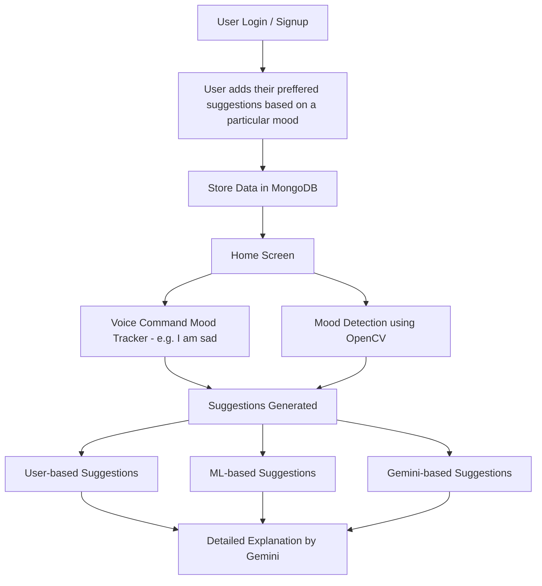

# 📔 Daily Mood Tracker with Suggestions

A web application that helps users **track their daily mood**, **analyze emotional patterns**, and receive **personalized suggestions** for self-improvement and mental well-being.  

---

## ✨ Features
- 📌 **Mood Logging** – Quickly log your daily mood (Happy, Sad, Anxious, Excited, etc.)  
- 🎤 **Voice Command Mood Tracking** – Speak your mood (e.g., "I am sad") and the system will detect it  
- 📷 **Camera-based Mood Detection** – Detect mood automatically using OpenCV facial expression recognition  
- 🎯 **Smart Suggestions** – Get personalized suggestions (activities, quotes, relaxation techniques)  
- 🤖 **Gemini-powered Explanations** – Click any suggestion to get a **detailed explanation powered by Gemini API**  
- 🔒 **User Authentication** – Secure login and registration system  
- 🔄 **Responsive Design** – Works seamlessly across devices  

---

## 🛠️ Tech Stack
- **Frontend:** React.js  
- **Backend:** Node.js + Express  
- **Database:** MongoDB 
- **Styling:** CSS3   
- **AI & ML:** OpenCV (mood detection), Gemini API (detailed suggestions)  

---

---

## 🚀 Getting Started

### Prerequisites
Make sure you have the following installed:  
- [Node.js](https://nodejs.org/) (v16+)  
- [MongoDB](https://www.mongodb.com/) (local or Atlas)  
- [Git](https://git-scm.com/)  

---

### 🔧 Installation & Setup

1. **Clone the repository**
   ```bash
   git clone https://github.com/Disu2004/Daily-mood-tracker-with-suggestions
   cd Daily-mood-tracker-with-suggestions
2. **Install frontend dependencies**

npm install
npm start

3. **Backend setup**

cd backend
npm install
npm start

4. **Open your browser and navigate to:**
👉 http://localhost:3000 (frontend)
👉 http://localhost:5000 (backend API)

### 🎥 Demo Video

📌 Watch the full demo in Given video
- https://drive.google.com/file/d/11jLejtXKfUCXn8vT0OVu6fvr7EfnRtkn/view?usp=sharing

## ✨ Features
- 📌 **Mood Logging** – Quickly log your daily mood (Happy, Sad, Anxious, Excited, etc.)  
- 📊 **Visual Trends** – View charts and graphs of your mood patterns over time  
- 🎯 **Three Types of Suggestions**  
  - **User-based** → predefined wellness tips for different moods  
  - **ML-based** → machine learning–driven recommendations  
  - **Gemini-based** → AI-powered suggestions with detailed explanations  
- 🖱️ **Interactive Suggestions** – When the user clicks on any suggestion, **Gemini provides an in-depth explanation** (e.g., why a suggestion is useful, benefits, and practical steps)  
- 📝 **Daily Notes** – Add custom notes or reflections for each mood entry  
- 🔒 **User Authentication** – Secure login and registration system  
- 🔄 **Responsive Design** – Works on desktop, tablet, and mobile  
## 💡 How It Works

1. The user **logs in / signs up** securely.  
2. Each day, the user **selects their mood** (e.g., Happy, Sad, Stressed, Excited) and can optionally add notes.  
3. The mood entry is stored in **MongoDB** for tracking and future analysis.  
4. A **dashboard** displays mood history with charts and statistics, helping the user identify emotional patterns over time.  
5. The system provides **three categories of suggestions**:
   - **User-based Suggestions** → predefined wellness tips and activities tailored to the selected mood.  
   - **ML-based Suggestions** → machine learning models recommend actions based on mood–activity patterns.  
   - **Gemini-based Suggestions** → AI-powered insights offering motivational quotes, mindfulness practices, and lifestyle tips.  
6. When the user **clicks on any suggestion**, Gemini **explains it in detail**, providing context, benefits, and actionable steps.  

---

### 🔄 Workflow Diagram



### 👨‍💻 Made with 💗 by  
**Dishant**, **Tushar**, and **Sakshee**

---

© 2025 Daily Mood Tracker with Suggestions. All rights reserved.


